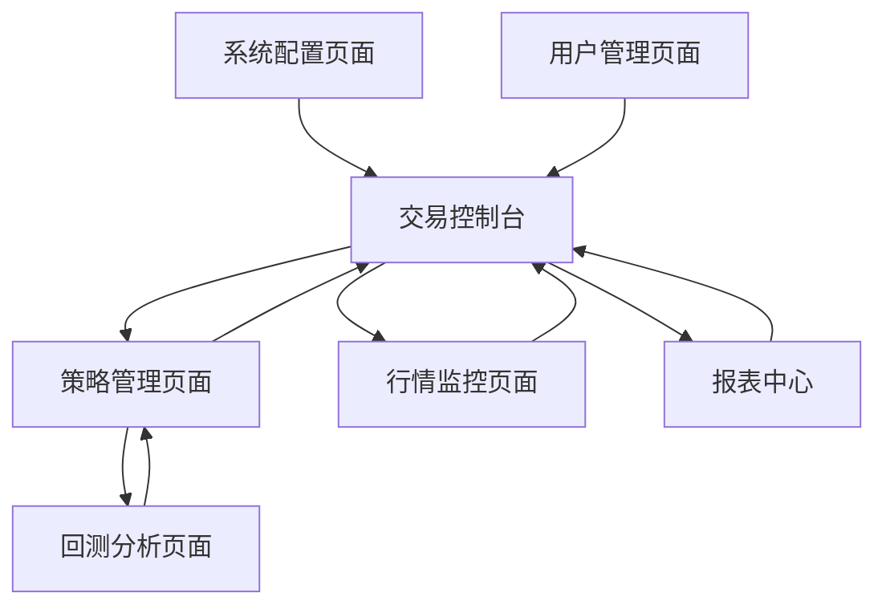

# CashUp 量化交易系统需求文档 V1.0

## 1. 产品概述

CashUp 是一个基于微服务架构的量化交易系统，专注于数字货币合约交易的自动化执行和策略管理。系统采用前后端分离设计，支持多交易所接入，提供完整的策略开发、回测验证、实盘交易和风险监控功能。

- 主要解决量化交易中的策略执行效率、风险控制和多平台管理问题，为量化交易者提供专业的交易工具和数据分析平台。
- 目标是构建一个高可用、高性能、易扩展的量化交易生态系统，支持策略的快速迭代和规模化部署。

## 2. 核心功能

### 2.1 用户角色

| 角色 | 注册方式 | 核心权限 |
|------|----------|----------|
| 系统管理员 | 系统初始化创建 | 系统配置管理、用户管理、监控告警 |
| 策略开发者 | 邀请码注册 | 策略开发、回测分析、实盘交易 |
| 普通用户 | 邮箱注册 | 查看行情、基础策略使用 |

### 2.2 功能模块

系统主要包含以下核心页面：

1. **交易控制台**：实时行情展示、持仓管理、订单监控、风险控制面板
2. **策略管理页面**：策略列表、策略配置、策略启停控制、策略性能监控
3. **回测分析页面**：历史数据回测、策略验证、回测报告生成和分析
4. **行情监控页面**：多交易对行情展示、技术指标分析、市场深度图表
5. **系统配置页面**：交易所配置、消息推送设置、风险参数配置
6. **报表中心**：交易报表、盈亏统计、风险分析报告
7. **用户管理页面**：用户信息、API密钥管理、权限设置

### 2.3 页面详情

| 页面名称 | 模块名称 | 功能描述 |
|----------|----------|----------|
| 交易控制台 | 实时行情模块 | 展示实时价格、成交量、涨跌幅等关键指标 |
| 交易控制台 | 持仓管理模块 | 显示当前持仓、浮动盈亏、保证金使用情况 |
| 交易控制台 | 订单监控模块 | 实时订单状态、成交记录、撤单操作 |
| 交易控制台 | 风险控制模块 | 风险指标监控、止损止盈设置、仓位控制 |
| 策略管理页面 | 策略列表模块 | 策略创建、编辑、删除、导入导出功能 |
| 策略管理页面 | 策略配置模块 | 参数设置、交易对选择、资金分配配置 |
| 策略管理页面 | 策略控制模块 | 策略启动、暂停、停止、重启操作 |
| 策略管理页面 | 性能监控模块 | 策略收益率、最大回撤、夏普比率等指标 |
| 回测分析页面 | 数据选择模块 | 历史数据时间范围、交易对、数据频率选择 |
| 回测分析页面 | 回测执行模块 | 回测任务提交、进度监控、结果查看 |
| 回测分析页面 | 报告生成模块 | 回测报告生成、图表展示、数据导出 |
| 行情监控页面 | 行情展示模块 | K线图、深度图、成交量分布图表 |
| 行情监控页面 | 技术指标模块 | MA、MACD、RSI等技术指标计算和展示 |
| 行情监控页面 | 市场分析模块 | 市场情绪分析、资金流向、热点监控 |
| 系统配置页面 | 交易所配置模块 | API密钥配置、交易参数设置、连接测试 |
| 系统配置页面 | 推送配置模块 | 微信推送、邮件通知、短信告警设置 |
| 系统配置页面 | 风险配置模块 | 最大仓位、止损比例、单笔交易限额设置 |
| 报表中心 | 交易报表模块 | 交易记录查询、统计分析、数据筛选 |
| 报表中心 | 盈亏统计模块 | 日/周/月盈亏统计、收益率曲线、风险指标 |
| 报表中心 | 风险分析模块 | VaR计算、压力测试、风险敞口分析 |
| 用户管理页面 | 用户信息模块 | 个人信息管理、密码修改、安全设置 |
| 用户管理页面 | API管理模块 | API密钥生成、权限配置、使用记录 |
| 用户管理页面 | 权限设置模块 | 功能权限、数据权限、操作权限配置 |

## 3. 核心流程

### 策略开发者操作流程
1. 用户登录系统后进入交易控制台查看市场概况
2. 进入策略管理页面创建或选择交易策略
3. 在回测分析页面对策略进行历史数据验证
4. 回测通过后在策略管理页面配置实盘参数
5. 启动策略开始实盘交易
6. 通过交易控制台监控策略执行情况
7. 在报表中心查看交易结果和风险分析

### 系统管理员操作流程
1. 登录后进入系统配置页面进行基础配置
2. 在用户管理页面管理用户权限和API配置
3. 通过交易控制台监控整体系统运行状态
4. 在报表中心查看系统整体运营数据

## 4. 用户界面设计

### 4.1 设计风格

- **主色调**：深蓝色 (#1a365d) 作为主色，绿色 (#38a169) 表示盈利，红色 (#e53e3e) 表示亏损
- **辅助色**：灰色 (#718096) 用于次要信息，白色 (#ffffff) 作为背景色
- **按钮样式**：圆角矩形按钮，支持悬停和点击状态变化
- **字体**：主要使用 14px 的 PingFang SC 字体，标题使用 16-20px 加粗
- **布局风格**：卡片式布局，顶部导航栏，左侧功能菜单，主内容区域采用网格布局
- **图标风格**：使用线性图标，支持暗色主题切换

### 4.2 页面设计概览

| 页面名称 | 模块名称 | UI元素 |
|----------|----------|--------|
| 交易控制台 | 实时行情模块 | 数据表格、实时更新数字、涨跌颜色标识、K线图表 |
| 交易控制台 | 持仓管理模块 | 持仓卡片、盈亏进度条、操作按钮组、风险指示器 |
| 策略管理页面 | 策略列表模块 | 策略卡片网格、状态标签、操作下拉菜单、搜索筛选器 |
| 策略管理页面 | 策略配置模块 | 表单组件、参数滑块、开关按钮、配置预览面板 |
| 回测分析页面 | 回测执行模块 | 进度条、结果图表、数据表格、导出按钮 |
| 行情监控页面 | 行情展示模块 | 交互式图表、数据面板、时间选择器、指标切换器 |
| 系统配置页面 | 配置表单模块 | 分组表单、验证提示、保存按钮、重置功能 |
| 报表中心 | 统计图表模块 | 多维度图表、数据筛选器、时间范围选择、导出功能 |

### 4.3 响应式设计

系统采用桌面优先的响应式设计，支持平板和移动设备访问。在移动端优化触摸交互，简化操作流程，确保核心功能在小屏幕设备上的可用性。