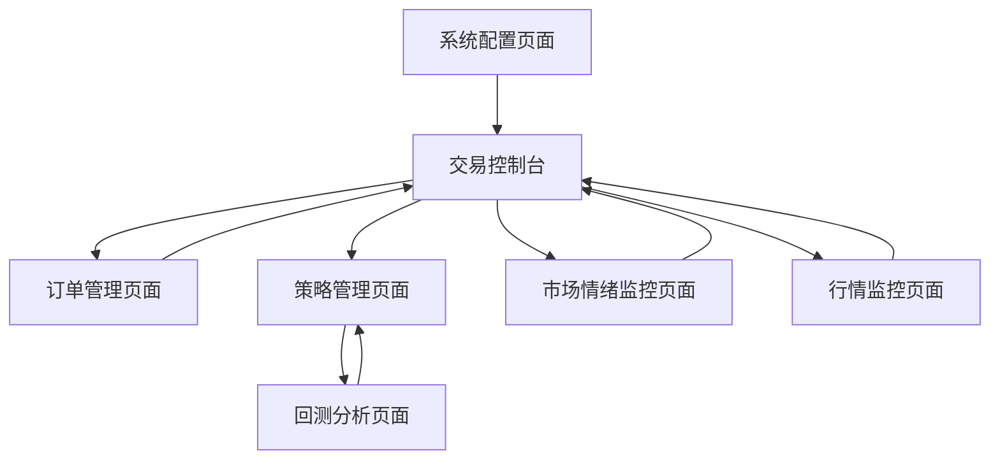

# CashUp 量化交易系统需求文档 V2.0

## 1. 产品概述

CashUp 是一个基于微服务架构的量化交易系统，专注于数字货币合约交易的自动化执行和策略管理。系统采用前后端分离设计，支持多交易所接入，提供完整的策略开发、回测验证、实盘交易、市场情绪监控和风险控制功能。

* 主要解决量化交易中的策略执行效率、市场情绪分析、风险控制和多平台管理问题，为量化交易者提供专业的交易工具和数据分析平台。

* 目标是构建一个高可用、高性能、易扩展的量化交易生态系统，支持策略的快速迭代、市场情绪监控和规模化部署。

## 2. 核心功能

### 2.1 用户角色

| 角色    | 注册方式    | 核心权限                     |
| ----- | ------- | ------------------------ |
| 系统管理员 | 系统初始化创建 | 系统配置管理、用户管理、监控告警、微服务管理   |
| 策略开发者 | 邀请码注册   | 策略开发、回测分析、实盘交易、订单管理、情绪监控 |
| 普通用户  | 邮箱注册    | 查看行情、基础策略使用、市场情绪查看       |

### 2.2 微服务架构划分

系统采用微服务架构，主要划分为以下服务模块：

1. **用户服务 (User Service)**：用户认证、权限管理、用户信息管理
2. **交易服务 (Trading Service)**：交易执行、仓位管理、风险控制
3. **订单服务 (Order Service)**：订单创建、修改、取消、查询、状态管理
4. **策略服务 (Strategy Service)**：策略管理、策略执行引擎、参数配置
5. **行情服务 (Market Service)**：实时行情数据、历史数据、WebSocket连接管理
6. **回测服务 (Backtest Service)**：历史数据回测、报告生成、性能分析
7. **通知服务 (Notification Service)**：消息推送、告警通知、定时任务
8. **情绪监控服务 (Sentiment Service)**：市场情绪分析、技术指标计算、情绪指数
9. **配置服务 (Config Service)**：统一配置管理、Apollo集成、环境变量管理
10. **网关服务 (Gateway Service)**：API网关、路由转发、负载均衡、认证鉴权

### 2.3 功能模块

系统主要包含以下核心页面：

1. **交易控制台**：实时行情展示、持仓管理、订单监控、风险控制面板、自定义监控交易对设置
2. **订单管理页面**：订单创建、修改、取消、查询、批量操作、订单历史
3. **策略管理页面**：策略列表、策略配置、策略启停控制、策略性能监控
4. **回测分析页面**：历史数据回测、策略验证、回测报告生成和分析
5. **市场情绪监控页面**：情绪指标展示、技术分析、市场热度、恐慌贪婪指数
6. **行情监控页面**：多交易对行情展示、技术指标分析、市场深度图表
7. **系统配置页面**：交易所配置、消息推送设置、风险参数配置、监控交易对管理

### 2.4 页面详情

| 页面名称     | 模块名称     | 功能描述                       |
| -------- | -------- | -------------------------- |
| 交易控制台    | 实时行情模块   | 展示实时价格、成交量、涨跌幅等关键指标        |
| 交易控制台    | 持仓管理模块   | 显示当前持仓、浮动盈亏、保证金使用情况        |
| 交易控制台    | 快速交易模块   | 快速下单、一键平仓、紧急止损功能           |
| 交易控制台    | 监控设置模块   | 自定义监控交易对、价格告警、成交量告警设置      |
| 订单管理页面   | 订单创建模块   | 市价单、限价单、止损单、止盈单创建          |
| 订单管理页面   | 订单查询模块   | 订单状态查询、历史订单、订单筛选功能         |
| 订单管理页面   | 订单操作模块   | 订单修改、取消、批量操作、订单复制          |
| 订单管理页面   | 成交记录模块   | 成交明细、手续费统计、成交分析            |
| 策略管理页面   | 策略列表模块   | 策略创建、编辑、删除、导入导出功能          |
| 策略管理页面   | 策略配置模块   | 参数设置、交易对选择、资金分配配置          |
| 策略管理页面   | 策略控制模块   | 策略启动、暂停、停止、重启操作            |
| 策略管理页面   | 性能监控模块   | 策略收益率、最大回撤、夏普比率等指标         |
| 回测分析页面   | 数据选择模块   | 历史数据时间范围、交易对、数据频率选择        |
| 回测分析页面   | 回测执行模块   | 回测任务提交、进度监控、结果查看           |
| 回测分析页面   | 报告生成模块   | 回测报告生成、图表展示、数据导出           |
| 市场情绪监控页面 | 恐慌贪婪指数模块 | 实时恐慌贪婪指数、历史趋势、市场情绪分析       |
| 市场情绪监控页面 | 技术指标模块   | RSI、MACD、布林带、KDJ等技术指标计算和展示 |
| 市场情绪监控页面 | 成交量分析模块  | 成交量趋势、资金流向、大单监控            |
| 市场情绪监控页面 | 市场热度模块   | 热门币种排行、涨跌幅统计、市场活跃度         |
| 行情监控页面   | 行情展示模块   | K线图、深度图、成交量分布图表            |
| 行情监控页面   | 多屏监控模块   | 多交易对同时监控、自定义布局、快速切换        |
| 行情监控页面   | 价格告警模块   | 价格突破告警、异常波动监控、自定义告警条件      |
| 系统配置页面   | 交易所配置模块  | API密钥配置、交易参数设置、连接测试        |
| 系统配置页面   | 推送配置模块   | 微信推送、邮件通知、短信告警设置           |
| 系统配置页面   | 监控配置模块   | 监控交易对管理、通知频率设置、告警阈值配置      |
| 系统配置页面   | 风险配置模块   | 最大仓位、止损比例、单笔交易限额设置         |

## 3. 核心流程

### 策略开发者操作流程

1. 用户登录系统后进入交易控制台查看市场概况和情绪指标
2. 在交易控制台设置自定义监控交易对和告警条件
3. 进入市场情绪监控页面分析市场情绪和技术指标
4. 进入策略管理页面创建或选择交易策略
5. 在回测分析页面对策略进行历史数据验证
6. 回测通过后在策略管理页面配置实盘参数
7. 启动策略开始实盘交易
8. 通过订单管理页面监控和管理交易订单
9. 接收定时推送的监控交易对行情和持仓盈亏报告

### 系统管理员操作流程

1. 登录后进入系统配置页面进行基础配置
2. 配置各微服务的连接参数和Apollo配置中心
3. 在系统配置页面管理全局监控交易对和通知设置
4. 通过交易控制台监控整体系统运行状态
5. 查看各微服务的健康状态和性能指标



## 4. 市场情绪监控功能

### 4.1 主流情绪指标

1. **恐慌贪婪指数 (Fear & Greed Index)**

   * 综合市场波动性、成交量、社交媒体情绪、市场调查等多维度数据

   * 0-100分值体系，0表示极度恐慌，100表示极度贪婪

   * 实时计算和历史趋势分析

2. **技术指标情绪分析**

   * **RSI (相对强弱指数)**：14日RSI，判断超买超卖状态

   * **MACD (指数平滑移动平均线)**：MACD线、信号线、柱状图分析

   * **布林带 (Bollinger Bands)**：价格通道分析，判断价格偏离程度

   * **KDJ指标**：随机指标，短期买卖信号

   * **威廉指标 (%R)**：超买超卖判断

3. **成交量情绪分析**

   * 成交量变化率分析

   * 大单流入流出监控

   * 资金流向分析

   * 持仓量变化趋势

4. **市场广度指标**

   * 涨跌家数比

   * 新高新低比例

   * 市场活跃度指数

### 4.2 情绪监控计算方法

1. **恐慌贪婪指数计算**

   ```
   恐慌贪婪指数 = (波动性权重 × 25% + 成交量权重 × 25% + 
                   社交媒体情绪 × 15% + 市场调查 × 15% + 
                   比特币占比 × 10% + 谷歌趋势 × 10%) × 100
   ```

2. **综合情绪评分**

   * RSI情绪分：RSI > 70 (贪婪)，RSI < 30 (恐慌)

   * MACD情绪分：金叉银叉信号强度

   * 成交量情绪分：成交量异常放大或缩小

   * 最终情绪评分：各指标加权平均

## 5. 订单管理功能

### 5.1 订单类型

1. **基础订单类型**

   * 市价单：按当前市场价格立即成交

   * 限价单：指定价格的挂单交易

   * 止损单：价格触发后转为市价单

   * 止盈单：盈利目标价格触发

2. **高级订单类型**

   * OCO订单：一个取消另一个订单

   * 冰山订单：大单拆分隐藏交易

   * 时间加权订单：TWAP算法执行

   * 条件订单：多条件触发机制

### 5.2 订单管理功能

1. **订单操作**

   * 订单创建、修改、取消

   * 批量订单操作

   * 订单模板保存和复用

   * 订单风险检查

2. **订单查询**

   * 实时订单状态查询

   * 历史订单记录

   * 订单执行明细

   * 多维度筛选和排序

## 6. 自定义监控功能

### 6.1 监控交易对设置

1. **交易对管理**

   * 添加/删除监控交易对

   * 交易对分组管理

   * 优先级设置

   * 监控频率配置

2. **告警条件设置**

   * 价格突破告警（上涨/下跌百分比）

   * 成交量异常告警

   * 技术指标告警（RSI、MACD等）

   * 情绪指数告警

### 6.2 定时通知功能

1. **通知内容**

   * 监控交易对实时行情

   * 价格变动趋势分析

   * 成交量和资金流向

   * 技术指标状态

   * 持仓盈亏情况

   * 每日盈亏报表

2. **通知渠道**

   * 微信公众号推送（wxpusher）

   * 企业微信通知

   * 邮件通知

   * 短信告警

   * Telegram机器人

3. **通知频率**

   * 实时告警（价格突破、异常波动）

   * 定时推送（每小时、每4小时、每日）

   * 自定义时间推送

   * 重要事件推送

## 7. 技术架构要求

### 7.1 微服务技术栈

* **开发语言**：Python 3.9+

* **Web框架**：FastAPI / Flask

* **数据库**：PostgreSQL 13+

* **消息队列**：RabbitMQ

* **配置中心**：Apollo

* **服务注册发现**：Consul

* **API网关**：Nginx

* **容器化**：Docker + Docker Compose

* **监控**：Prometheus + Grafana

* **日志**：ELK Stack

### 7.2 前端技术栈

* **框架**：React 18+ / Vue 3+

* **状态管理**：Redux / Vuex

* **UI组件库**：Ant Design / Element Plus

* **图表库**：ECharts / TradingView

* **构建工具**：Vite / Webpack

### 7.3 数据存储设计

* **用户数据**：PostgreSQL

* **行情数据**：InfluxDB / TimescaleDB

* **缓存**：Redis

* **文件存储**：MinIO / AWS S3

* **配置数据**：Apollo Config

### 7.4 安全要求

* **API安全**：JWT认证 + OAuth2

* **数据加密**：AES-256加密

* **传输安全**：HTTPS + WSS

* **密钥管理**：环境变量 + Vault

* **访问控制**：RBAC权限模型

## 8. 用户界面设计

### 8.1 设计风格

* **主色调**：深蓝色 (#1a365d) 作为主色，绿色 (#38a169) 表示盈利，红色 (#e53e3e) 表示亏损

* **辅助色**：橙色 (#ed8936) 表示警告，紫色 (#805ad5) 表示情绪指标

* **按钮样式**：圆角矩形按钮，支持悬停和点击状态变化

* **字体**：主要使用 14px 的 PingFang SC 字体，标题使用 16-20px 加粗

* **布局风格**：卡片式布局，顶部导航栏，左侧功能菜单，主内容区域采用网格布局

* **图标风格**：使用线性图标，支持暗色主题切换，情绪指标使用渐变色

### 8.2 页面设计概览

| 页面名称     | 模块名称     | UI元素                       |
| -------- | -------- | -------------------------- |
| 交易控制台    | 监控设置模块   | 交易对选择器、告警阈值滑块、通知开关、自定义配置面板 |
| 订单管理页面   | 订单创建模块   | 订单类型选择、价格输入框、数量滑块、风险提示框    |
| 订单管理页面   | 订单列表模块   | 状态标签、操作按钮组、批量选择、实时更新指示器    |
| 市场情绪监控页面 | 恐慌贪婪指数模块 | 圆形进度条、情绪色彩渐变、历史趋势图、情绪解读文本  |
| 市场情绪监控页面 | 技术指标模块   | 多指标仪表盘、信号强度条、买卖信号提示、指标组合分析 |
| 系统配置页面   | 监控配置模块   | 交易对管理表格、通知频率选择、推送渠道配置、测试按钮 |

### 8.3 响应式设计

系统采用桌面优先的响应式设计，支持平板和移动设备访问。移动端优化情绪监控和订单管理的触摸交互，提供简化的监控面板和快速交易功能。
