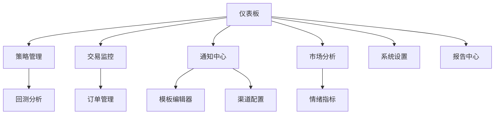

# CashUp 量化交易系统需求文档 V3.0

## 1. 产品概述

CashUp是一个专业的量化交易系统，支持多交易所接入、策略回测、实时监控和智能通知。系统采用微服务架构，提供高可用、可扩展的量化交易解决方案。

## 2. 核心功能

### 2.1 用户角色

| 角色    | 注册方式  | 核心权限           |
| ----- | ----- | -------------- |
| 交易员   | 邮箱注册  | 策略执行、交易监控、风险管理 |
| 策略开发者 | 邀请码注册 | 策略开发、回测分析、模型优化 |
| 系统管理员 | 内部分配  | 系统配置、用户管理、监控运维 |

### 2.2 功能模块

系统包含以下核心页面：

1. **仪表板页面**：实时行情展示、持仓概览、收益统计、系统状态监控
2. **策略管理页面**：策略列表、策略配置、回测报告、策略性能分析
3. **交易监控页面**：实时交易、订单管理、风险控制、交易历史
4. **通知中心页面**：通知模板管理、渠道配置、消息历史、告警设置
5. **市场分析页面**：行情图表、技术指标、市场情绪、资金流向
6. **系统设置页面**：用户配置、API管理、安全设置、日志查看
7. **报告中心页面**：收益报告、风险报告、策略分析、数据导出

### 2.3 页面详情

| 页面名称   | 模块名称   | 功能描述                    |
| ------ | ------ | ----------------------- |
| 仪表板页面  | 实时行情   | 显示主要交易对价格、涨跌幅、成交量等实时数据  |
| 仪表板页面  | 持仓概览   | 展示当前持仓、浮动盈亏、持仓分布饼图      |
| 仪表板页面  | 收益统计   | 显示日收益、周收益、月收益曲线图和统计数据   |
| 策略管理页面 | 策略列表   | 展示所有策略、状态、收益率、最后运行时间    |
| 策略管理页面 | 策略配置   | 策略参数设置、风险控制、交易对选择       |
| 策略管理页面 | 回测分析   | 历史数据回测、收益曲线、风险指标分析      |
| 交易监控页面 | 实时交易   | 显示当前活跃订单、成交记录、交易状态      |
| 交易监控页面 | 订单管理   | 订单创建、修改、取消、查询、批量操作      |
| 交易监控页面 | 风险控制   | 仓位限制、止损止盈、最大回撤控制        |
| 通知中心页面 | 模板管理   | 创建、编辑、预览通知模板，支持变量替换     |
| 通知中心页面 | 渠道配置   | 配置邮件、微信、QANotify等通知渠道参数 |
| 通知中心页面 | 可视化编辑器 | 拖拽式模板编辑，数据源绑定，实时预览      |
| 市场分析页面 | 情绪监控   | 恐慌贪婪指数、RSI、MACD等技术指标    |
| 市场分析页面 | 资金流向   | 大单监控、资金净流入流出分析          |
| 系统设置页面 | API管理  | 交易所API配置、权限设置、连接测试      |
| 报告中心页面 | 数据导出   | 交易记录、收益报告、策略分析数据导出      |

## 3. 微服务架构设计

### 3.1 服务划分

1. **用户服务 (User Service)**：用户认证、权限管理、用户信息维护
2. **交易服务 (Trading Service)**：订单执行、交易逻辑、风险控制
3. **策略服务 (Strategy Service)**：策略管理、回测引擎、策略执行
4. **行情服务 (Market Service)**：WebSocket行情接收、数据处理、技术指标计算
5. **通知服务 (Notification Service)**：消息推送、模板管理、渠道配置
6. **订单服务 (Order Service)**：订单生命周期管理、订单状态跟踪
7. **配置服务 (Config Service)**：统一配置管理、Apollo集成
8. **监控服务 (Monitor Service)**：系统监控、日志收集、性能分析

### 3.2 通知服务详细设计

#### 3.2.1 通知渠道管理

* **渠道类型**：邮件(SMTP)、微信公众号、企业微信、钉钉、QANotify、WxPusher、Pusher

* **渠道配置**：每个渠道支持独立配置参数（API密钥、服务器地址、认证信息等）

* **渠道状态**：启用/禁用、连接测试、发送统计

* **优先级设置**：支持渠道优先级和故障转移

#### 3.2.2 通知模板系统

* **模板类型**：

  * 行情提醒模板（价格突破、技术指标信号）

  * 交易通知模板（订单成交、持仓变化）

  * 风险告警模板（止损触发、仓位超限）

  * 系统通知模板（策略启停、系统异常）

  * 日报模板（收益汇总、持仓报告）

* **变量系统**：

  * **行情变量**：`{symbol}`, `{price}`, `{change_percent}`, `{volume}`, `{high}`, `{low}`

  * **交易变量**：`{order_id}`, `{side}`, `{quantity}`, `{filled_price}`, `{commission}`

  * **持仓变量**：`{position_size}`, `{unrealized_pnl}`, `{realized_pnl}`, `{margin_ratio}`

  * **策略变量**：`{strategy_name}`, `{strategy_status}`, `{total_return}`, `{max_drawdown}`

  * **系统变量**：`{timestamp}`, `{user_name}`, `{system_status}`, `{error_message}`

  * **技术指标变量**：`{rsi}`, `{macd}`, `{bollinger_upper}`, `{bollinger_lower}`, `{fear_greed_index}`

* **模板格式**：

  * **文本模板**：支持纯文本和Markdown格式

  * **HTML模板**：支持富文本邮件格式

  * **JSON模板**：支持API接口调用格式

#### 3.2.3 可视化模板编辑器

* **拖拽界面**：

  * 左侧数据源面板：按类别展示所有可用变量

  * 中间编辑区域：模板内容编辑，支持拖拽变量

  * 右侧预览面板：实时预览渲染效果

* **编辑功能**：

  * 变量拖拽绑定

  * 条件逻辑设置（if/else语句）

  * 循环结构支持（for循环）

  * 格式化函数（数字格式、日期格式、百分比等）

* **模板验证**：

  * 语法检查

  * 变量有效性验证

  * 渲染测试

  * 发送测试

#### 3.2.4 模板版本管理

* **版本控制**：模板修改历史记录、版本回滚

* **模板复用**：模板复制、导入导出、模板库

* **权限管理**：模板创建、编辑、删除权限控制

* **审批流程**：重要模板变更需要审批确认

## 4. 核心流程

### 4.1 交易员操作流程

1. 登录系统 → 查看仪表板 → 监控持仓和收益
2. 配置通知模板 → 设置监控规则 → 接收实时通知
3. 查看策略表现 → 调整策略参数 → 执行交易决策

### 4.2 通知流程

1. 数据源触发 → 规则匹配 → 模板渲染 → 渠道发送 → 状态记录

### 4.3 页面导航流程

## 5. 技术架构

### 5.1 技术栈

* **后端语言**：Python 3.9+

* **Web框架**：FastAPI

* **数据库**：PostgreSQL 14+

* **消息队列**：RabbitMQ

* **配置中心**：Apollo

* **容器化**：Docker + Docker Compose

* **前端框架**：React + TypeScript

* **状态管理**：Redux Toolkit

* **UI组件库**：Ant Design

### 5.2 数据库设计

* **用户表**：用户信息、权限、配置

* **策略表**：策略定义、参数、状态

* **订单表**：订单信息、执行状态、历史记录

* **行情表**：实时行情、历史数据、技术指标

* **通知表**：通知记录、发送状态、模板关联

* **模板表**：模板内容、版本信息、使用统计

* **渠道表**：渠道配置、状态监控、发送统计

### 5.3 外部集成

* **交易所API**：GateIO USDT合约交易

* **行情数据**：WebSocket实时行情订阅

* **通知渠道**：邮件SMTP、微信API、QANotify、WxPusher

* **配置管理**：Apollo配置中心

* **监控告警**：Prometheus + Grafana

## 6. 用户界面设计

### 6.1 设计风格

* **主色调**：深蓝色(#1890ff)、辅助色绿色(#52c41a)、红色(#ff4d4f)

* **按钮样式**：圆角按钮、渐变效果

* **字体**：系统默认字体，标题16px，正文14px

* **布局风格**：卡片式布局、左侧导航

* **图标风格**：线性图标、统一风格

### 6.2 页面设计概览

| 页面名称 | 模块名称  | UI元素             |
| ---- | ----- | ---------------- |
| 仪表板  | 实时行情  | 数据卡片、涨跌颜色标识、刷新动画 |
| 仪表板  | 收益图表  | 折线图、面积图、时间选择器    |
| 通知中心 | 模板编辑器 | 三栏布局、拖拽区域、实时预览   |
| 通知中心 | 渠道配置  | 表单组件、状态指示器、测试按钮  |
| 策略管理 | 策略列表  | 表格组件、状态标签、操作按钮   |
| 交易监控 | 订单管理  | 实时表格、筛选器、批量操作    |

### 6.3 响应式设计

* **桌面优先**：主要面向桌面端交易员使用

* **移动适配**：支持平板和手机查看关键信息

* **触控优化**：移动端优化按钮大小和交互体验

## 7. 部署和运维

### 7.1 容器化部署

* **Docker Compose**：一键部署所有服务

* **环境隔离**：开发、测试、生产环境分离

* **配置管理**：通过.env文件管理敏感信息

* **服务发现**：内部服务通过服务名通信

### 7.2 监控和日志

* **应用监控**：服务健康检查、性能指标

* **业务监控**：交易成功率、通知送达率

* **日志收集**：结构化日志、集中存储

* **告警机制**：关键指标异常自动告警

### 7.3 安全措施

* **API安全**：JWT认证、HTTPS传输

* **数据加密**：敏感数据加密存储

* **访问控制**：基于角色的权限管理

* **审计日志**：关键操作记录和追踪

