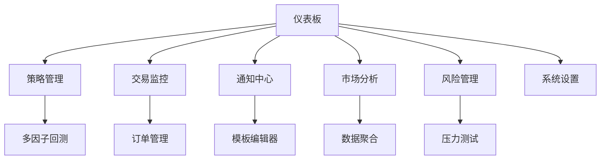

# CashUp 量化交易系统需求文档 V4.0

## 1. 产品概述

CashUp是一个专业的量化交易系统，支持多交易所接入、策略回测、实时监控和智能通知。系统采用微服务架构，提供高可用、可扩展的量化交易解决方案。

## 2. 核心功能

### 2.1 用户角色

| 角色    | 注册方式  | 核心权限           |
| ----- | ----- | -------------- |
| 交易员   | 邮箱注册  | 策略执行、交易监控、风险管理 |
| 策略开发者 | 邀请码注册 | 策略开发、回测分析、模型优化 |
| 系统管理员 | 内部分配  | 系统配置、用户管理、监控运维 |

### 2.2 功能模块

系统包含以下核心页面：

1. **仪表板页面**：实时行情展示、持仓概览、收益统计、系统状态监控
2. **策略管理页面**：策略列表、策略配置、回测报告、策略性能分析
3. **交易监控页面**：实时交易、订单管理、风险控制、交易历史
4. **通知中心页面**：通知模板管理、渠道配置、消息历史、告警设置
5. **市场分析页面**：行情图表、技术指标、市场情绪、资金流向
6. **风险管理页面**：实时风险监控、组合分析、压力测试、风险报告
7. **系统设置页面**：用户配置、API管理、安全设置、日志查看

### 2.3 页面详情

| 页面名称   | 模块名称   | 功能描述                    |
| ------ | ------ | ----------------------- |
| 仪表板页面  | 实时行情   | 显示主要交易对价格、涨跌幅、成交量等实时数据  |
| 仪表板页面  | 持仓概览   | 展示当前持仓、浮动盈亏、持仓分布饼图      |
| 仪表板页面  | 收益统计   | 显示日收益、周收益、月收益曲线图和统计数据   |
| 策略管理页面 | 策略列表   | 展示所有策略、状态、收益率、最后运行时间    |
| 策略管理页面 | 策略配置   | 策略参数设置、风险控制、交易对选择       |
| 策略管理页面 | 回测分析   | 历史数据回测、收益曲线、风险指标分析      |
| 策略管理页面 | 多因子回测  | 支持多因子模型回测、自定义指标、结果对比    |
| 交易监控页面 | 实时交易   | 显示当前活跃订单、成交记录、交易状态      |
| 交易监控页面 | 订单管理   | 订单创建、修改、取消、查询、批量操作      |
| 交易监控页面 | 风险控制   | 仓位限制、止损止盈、最大回撤控制        |
| 通知中心页面 | 模板管理   | 创建、编辑、预览通知模板，支持变量替换     |
| 通知中心页面 | 渠道配置   | 配置邮件、微信、QANotify等通知渠道参数 |
| 通知中心页面 | 可视化编辑器 | 拖拽式模板编辑，数据源绑定，实时预览      |
| 市场分析页面 | 情绪监控   | 恐慌贪婪指数、RSI、MACD等技术指标    |
| 市场分析页面 | 资金流向   | 大单监控、资金净流入流出分析          |
| 市场分析页面 | 数据聚合   | 多交易所数据整合、基本面数据、另类数据源    |
| 风险管理页面 | 实时风险   | VaR计算、最大回撤监控、风险预警       |
| 风险管理页面 | 组合分析   | 投资组合风险分析、相关性分析、敞口管理     |
| 风险管理页面 | 压力测试   | 极端市场情况模拟、压力测试报告         |
| 系统设置页面 | API管理  | 交易所API配置、权限设置、连接测试      |

## 3. 微服务架构设计

### 3.1 服务划分

1. **用户服务 (User Service)**：用户认证、权限管理、用户信息维护
2. **交易服务 (Trading Service)**：订单执行、交易逻辑、风险控制
3. **策略服务 (Strategy Service)**：策略管理、回测引擎、策略执行
4. **行情服务 (Market Service)**：WebSocket行情接收、数据处理、技术指标计算
5. **通知服务 (Notification Service)**：消息推送、模板管理、渠道配置
6. **订单服务 (Order Service)**：订单生命周期管理、订单状态跟踪
7. **风险服务 (Risk Service)**：实时风险计算、组合分析、压力测试
8. **数据服务 (Data Service)**：多源数据聚合、数据清洗、存储管理
9. **配置服务 (Config Service)**：统一配置管理、Apollo集成
10. **监控服务 (Monitor Service)**：系统监控、日志收集、性能分析

### 3.2 新增核心服务详细设计

#### 3.2.1 回测引擎增强 (Strategy Service)

* **多因子回测支持**：
  * 支持多个因子同时回测（价格因子、技术因子、基本面因子等）
  * 因子权重动态调整和优化
  * 因子有效性分析和筛选
  * 因子相关性分析和去重

* **自定义回测指标**：
  * 用户可自定义回测评价指标
  * 支持复合指标计算（如信息比率、卡尔马比率等）
  * 指标模板库和指标分享功能
  * 指标可视化展示和导出

* **回测结果对比功能**：
  * 多策略回测结果并行对比
  * 不同时间段回测结果对比
  * 参数敏感性分析
  * 回测报告生成和分享

#### 3.2.2 风险管理模块 (Risk Service)

* **实时风险计算**：
  * **VaR计算**：历史模拟法、参数法、蒙特卡洛模拟
  * **最大回撤监控**：实时计算和预警
  * **波动率监控**：历史波动率、隐含波动率
  * **Beta系数**：相对市场风险度量

* **组合风险分析**：
  * 投资组合整体风险评估
  * 资产相关性分析
  * 风险敞口分析（行业、地区、货币等）
  * 风险贡献度分析

* **压力测试功能**：
  * 历史情景重现（如2008金融危机、2020疫情等）
  * 自定义压力情景设计
  * 极端市场情况模拟
  * 压力测试报告和建议

#### 3.2.3 数据源扩展 (Data Service)

* **多交易所数据聚合**：
  * 支持币安、火币、OKEx、Coinbase等主流交易所
  * 数据标准化和统一格式处理
  * 跨交易所套利机会识别
  * 数据质量监控和异常处理

* **基本面数据接入**：
  * 宏观经济数据（GDP、CPI、利率等）
  * 加密货币基本面数据（链上数据、开发活跃度等）
  * 财务数据（对于股票等传统资产）
  * 行业数据和研究报告

* **另类数据源**：
  * **新闻数据**：财经新闻、公告、研报等文本分析
  * **社交媒体**：Twitter、Reddit、Telegram情绪分析
  * **搜索趋势**：Google Trends、百度指数等
  * **链上数据**：区块链交易数据、地址分析、资金流向

### 3.3 通知服务详细设计

#### 3.3.1 通知渠道管理

* **渠道类型**：邮件(SMTP)、微信公众号、企业微信、钉钉、QANotify、WxPusher、Pusher
* **渠道配置**：每个渠道支持独立配置参数（API密钥、服务器地址、认证信息等）
* **渠道状态**：启用/禁用、连接测试、发送统计
* **优先级设置**：支持渠道优先级和故障转移

#### 3.3.2 通知模板系统

* **模板类型**：
  * 行情提醒模板（价格突破、技术指标信号）
  * 交易通知模板（订单成交、持仓变化）
  * 风险告警模板（止损触发、仓位超限）
  * 系统通知模板（策略启停、系统异常）
  * 日报模板（收益汇总、持仓报告）

* **变量系统**：
  * **行情变量**：`{symbol}`, `{price}`, `{change_percent}`, `{volume}`, `{high}`, `{low}`
  * **交易变量**：`{order_id}`, `{side}`, `{quantity}`, `{filled_price}`, `{commission}`
  * **持仓变量**：`{position_size}`, `{unrealized_pnl}`, `{realized_pnl}`, `{margin_ratio}`
  * **策略变量**：`{strategy_name}`, `{strategy_status}`, `{total_return}`, `{max_drawdown}`
  * **风险变量**：`{var_1d}`, `{var_5d}`, `{max_drawdown}`, `{volatility}`, `{beta}`
  * **系统变量**：`{timestamp}`, `{user_name}`, `{system_status}`, `{error_message}`
  * **技术指标变量**：`{rsi}`, `{macd}`, `{bollinger_upper}`, `{bollinger_lower}`, `{fear_greed_index}`

#### 3.3.3 可视化模板编辑器

* **拖拽界面**：
  * 左侧数据源面板：按类别展示所有可用变量
  * 中间编辑区域：模板内容编辑，支持拖拽变量
  * 右侧预览面板：实时预览渲染效果

* **编辑功能**：
  * 变量拖拽绑定
  * 条件逻辑设置（if/else语句）
  * 循环结构支持（for循环）
  * 格式化函数（数字格式、日期格式、百分比等）

## 4. 核心流程

### 4.1 交易员操作流程

1. 登录系统 → 查看仪表板 → 监控持仓和收益
2. 配置通知模板 → 设置监控规则 → 接收实时通知
3. 查看策略表现 → 调整策略参数 → 执行交易决策
4. 风险监控 → 查看VaR和回撤 → 调整仓位配置

### 4.2 策略开发者操作流程

1. 策略开发 → 多因子回测 → 自定义指标分析
2. 回测结果对比 → 参数优化 → 策略部署
3. 实时监控 → 风险评估 → 策略调整

### 4.3 页面导航流程

## 5. 技术架构

### 5.1 技术栈

* **后端语言**：Python 3.9+
* **Web框架**：FastAPI
* **数据库**：PostgreSQL 14+
* **消息队列**：RabbitMQ
* **配置中心**：Apollo
* **容器化**：Docker + Docker Compose
* **前端框架**：React + TypeScript
* **状态管理**：Redux Toolkit
* **UI组件库**：Ant Design
* **数据分析**：Pandas, NumPy, SciPy
* **机器学习**：Scikit-learn, TensorFlow

### 5.2 数据库设计

* **用户表**：用户信息、权限、配置
* **策略表**：策略定义、参数、状态
* **订单表**：订单信息、执行状态、历史记录
* **行情表**：实时行情、历史数据、技术指标
* **通知表**：通知记录、发送状态、模板关联
* **模板表**：模板内容、版本信息、使用统计
* **渠道表**：渠道配置、状态监控、发送统计
* **风险表**：风险指标、计算结果、历史记录
* **回测表**：回测配置、结果数据、性能指标
* **数据源表**：外部数据源配置、同步状态

### 5.3 外部集成

* **交易所API**：GateIO USDT合约交易，预留其他交易所接口
* **行情数据**：WebSocket实时行情订阅，多交易所数据聚合
* **通知渠道**：邮件SMTP、微信API、QANotify、WxPusher
* **配置管理**：Apollo配置中心
* **监控告警**：Prometheus + Grafana
* **数据源**：财经新闻API、社交媒体API、链上数据API

## 6. 用户界面设计

### 6.1 设计风格

* **主色调**：深蓝色(#1890ff)、辅助色绿色(#52c41a)、红色(#ff4d4f)
* **按钮样式**：圆角按钮、渐变效果
* **字体**：系统默认字体，标题16px，正文14px
* **布局风格**：卡片式布局、左侧导航
* **图标风格**：线性图标、统一风格

### 6.2 页面设计概览

| 页面名称 | 模块名称  | UI元素             |
| ---- | ----- | ---------------- |
| 仪表板  | 实时行情  | 数据卡片、涨跌颜色标识、刷新动画 |
| 仪表板  | 收益图表  | 折线图、面积图、时间选择器    |
| 策略管理 | 回测对比  | 并行图表、参数调节器、结果表格  |
| 风险管理 | VaR监控 | 仪表盘、风险热力图、预警指示器  |
| 通知中心 | 模板编辑器 | 三栏布局、拖拽区域、实时预览   |
| 市场分析 | 数据聚合  | 多源数据图表、筛选器、对比视图  |

### 6.3 响应式设计

* **桌面优先**：主要面向桌面端交易员使用
* **移动适配**：支持平板和手机查看关键信息
* **触控优化**：移动端优化按钮大小和交互体验

## 7. 部署和运维

### 7.1 容器化部署

* **Docker Compose**：一键部署所有服务
* **环境隔离**：开发、测试、生产环境分离
* **配置管理**：通过.env文件管理敏感信息
* **服务发现**：内部服务通过服务名通信

### 7.2 监控和日志

* **应用监控**：服务健康检查、性能指标
* **业务监控**：交易成功率、通知送达率、风险指标
* **日志收集**：结构化日志、集中存储
* **告警机制**：关键指标异常自动告警

### 7.3 安全措施

* **API安全**：JWT认证、HTTPS传输
* **数据加密**：敏感数据加密存储
* **访问控制**：基于角色的权限管理
* **审计日志**：关键操作记录和追踪

## 8. 待优化功能清单

> 以下功能为后续版本优化方向，按优先级排序：

### 8.1 技术架构优化

#### 高优先级
* **缓存策略**：增加Redis缓存层，用于行情数据缓存、用户会话管理
* **API网关**：统一处理认证、限流、监控和路由
* **数据库优化**：读写分离设计，时序数据库存储历史行情

#### 中优先级
* **消息队列优化**：考虑使用Kafka处理高频行情数据
* **微服务治理**：服务注册发现、分布式链路追踪、熔断降级
* **数据分片策略**：应对大量历史数据存储

### 8.2 安全性增强

#### 高优先级
* **多因子认证**：支持2FA、硬件密钥等
* **API安全增强**：API签名验证、IP白名单
* **数据脱敏**：敏感数据展示脱敏处理

### 8.3 用户体验优化

#### 中优先级
* **移动端支持**：开发移动端App或PWA
* **国际化支持**：多语言和多时区支持
* **个性化配置**：用户自定义界面布局和主题

#### 低优先级
* **智能推荐**：基于用户行为的策略推荐
* **社交功能**：策略分享、讨论社区
* **教育模块**：量化交易教程和模拟交易

### 8.4 高级功能扩展

#### 低优先级
* **AI辅助决策**：机器学习模型辅助策略优化
* **跨链支持**：支持DeFi协议和跨链交易
* **算法交易**：高频交易算法和延迟优化
* **合规模块**：监管报告和合规检查

---

**注意**：待优化功能清单将根据用户反馈、市场需求和技术发展情况动态调整优先级。建议在完成核心功能后，按优先级逐步实施这些优化功能。